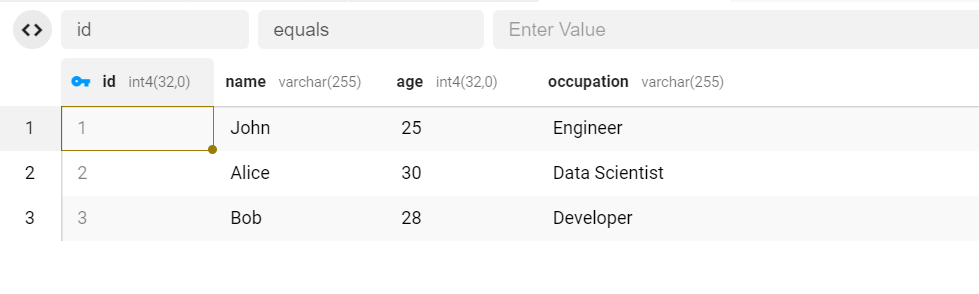

# CSV Parsing Tool

This is step one of a robust Command-Line Interface (CLI) tool meticulously engineered for seamless data-driven business analysis. Designed and implemented by a golang backend engineer, this tool focuses on providing powerful backend capabilities, including CSV data parsing, PostgreSQL integration, and the groundwork for advanced analytics processing. 

## Table of Contents


-   [Focus](#focusn)
-   [Usage](#usage)
-   [API Endpoints](#api-endpoints)
    -   [Submit Data (`POST /data`)](#submit-data-post-data)
    -   [Retrieve Analysis Results (`GET /analysis`)](#retrieving-analysis-results)
-   [Images](#images)

-   [Contributing](#contributing)

## Focus

This tool is the result of a backend engineer's dedication to crafting a performant and reliable solution for real-word problems such as data analysis. Built with the Go programming language, it ensures efficiency, scalability, and maintainability in the backend infrastructure. The PostgreSQL integration showcases the backend's prowess in handling data storage and retrieval with precision.

## Features

- **CSV Data Parsing**: Effortlessly parse CSV files with the `parsecsv` command.
- **PostgreSQL Integration**: Seamlessly connect to a PostgreSQL database using the `connectdb` command.
- **Foundations for Advanced Analytics**: Lay the groundwork for advanced statistical analysis tasks, demonstrating a backend-centric approach.


## Customization

For demonstrative purpose, this program comes with a test csv which includes the columns `Name`, `Age` and `Occupation`. Feel free to customise the code for your own purposes, and use csv files with any parameters of your choice. Be sure the edit `db.go` first! 

## Upcoming Features

Stay tuned for the next version of this tool, which will introduce advanced features such as:

-   **Python Script Integration**: Seamlessly incorporate Python scripts for specialized statistical analysis tasks.
-   **Enhanced Analytics Processing**: Elevate your backend-driven data analysis capabilities to the next level.

I have posted this version in the meantime as it can serve as a standalone tool in its own right.

## Usage

### Installation

Ensure you have [Go](https://golang.org/) installed on your system.

Clone the repository
```
bash

git clone https://github.com/amy324/CLI-CSV-Parsing-Tool.git
```
 Navigate to the project directory
 ```
cd CLI-CSV-Parsing-Tool
```
Install all dependencies.

Create a `.env` file. Set up a `PostgreSQL` database and include the details in the .env file formatted as follows:
```
POSTGRES_USER=
POSTGRES_PASSWORD=
POSTGRES_DB=

```
Build the CLI tool
```
go build -o CLI-CSV-Parsing-Too .
```

 Run the tool
 ```
./CLI-CSV-Parsing-Too [command] `
```
## Commands


-   **connectdb**: Connect to PostgreSQL database.
-   **parsecsv**: Parse CSV file.

### Example:


```
bash

$ ./CLI-Data-Analysis-Tool parsecsv test_data.csv

```
### Example Output: 
```
CSV File: test_data.csv
Number of Rows: 4
Number of Columns: 3
2024/01/26 16:01:30 Connecting to PostgreSQL...
CSV data processed and saved to PostgreSQL.
```
### Results:



A screenshot showing the CSV contents have been added to the Postgres database shown here via [Beekeeper SQL management tool](https://www.beekeeperstudio.io/get)

 
## Contributing


Contributions are welcome! If you have suggestions, bug reports, or would like to contribute code, please open an issue or a pull request.

License
-------

This project is licensed under the MIT License.

